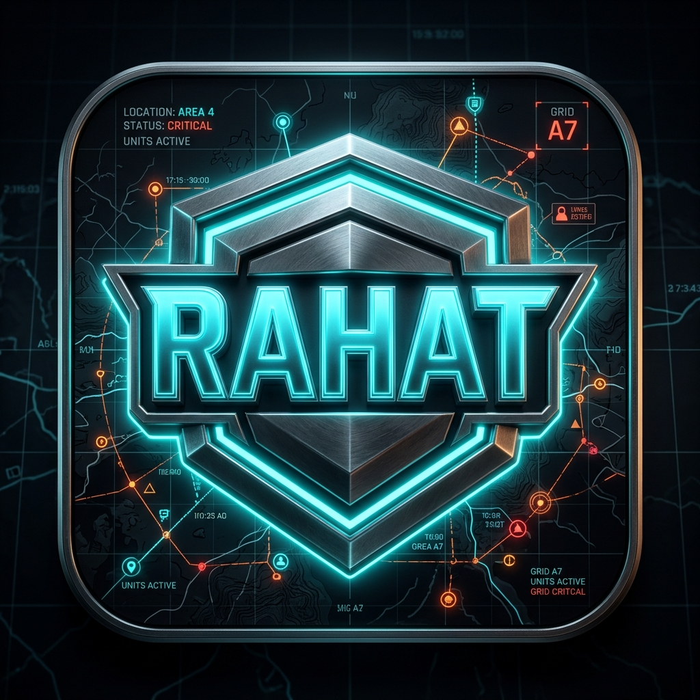
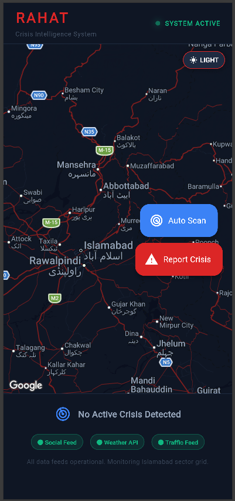
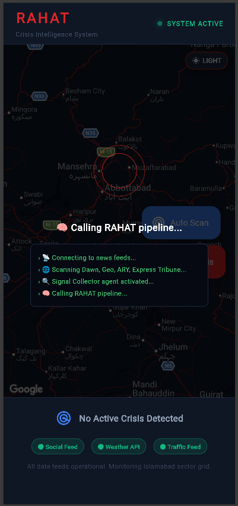
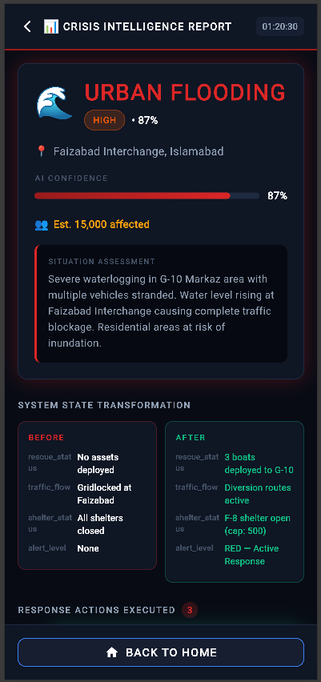
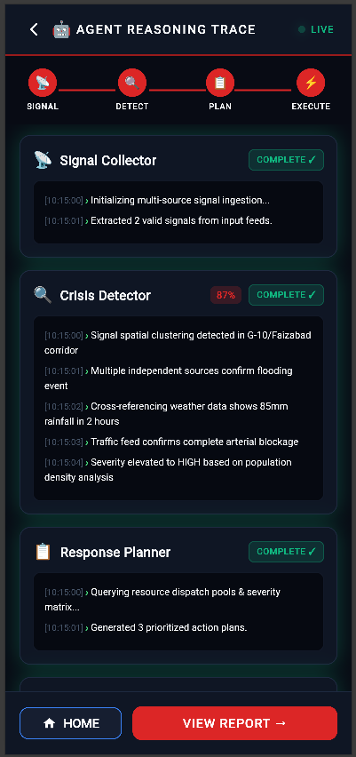
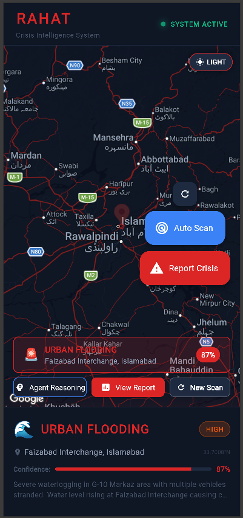

# README.md for RAHAT Flutter App Repository

Paste this entire content into your README.md file in the Flutter repo root.
Replace all [PLACEHOLDER] values with your actual links.

---

# 🚨 RAHAT — Real-time Agentic Hazard & Action Tracker

<div align="center">



**AI-Powered Crisis Intelligence System for Islamabad & Rawalpindi**

[](https://flutter.dev)
[](https://fastapi.tiangolo.com)
[](https://ai.google.dev)
[](https://antigravity.google.dev)
[](LICENSE)

[📱 Download APK](releases/RAHAT.apk) • [🎥 Watch Demo](YOUR_DEMO_VIDEO_LINK) • [🔗 Live Backend](YOUR_RAILWAY_URL) • [📖 Backend Repo](YOUR_BACKEND_REPO_LINK)

</div>

---

## 🏆 Google Antigravity Hackathon — Challenge 3: Crisis Intelligence & Response Orchestrator (CIRO)

RAHAT is an **Agentic AI System** that detects emerging crisis situations in Islamabad and Rawalpindi in real-time, generates coordinated response actions, and simulates their execution — transforming unstructured signals into life-saving decisions.

---

## 📱 App Screenshots

<div align="center">
<table>
<tr>
<td><br/><b>Home Page</b></td>
<td><br/><b>Agents Processing</b></td>
<td><br/><b>Output After Analyzing</b></td>
<td><br/><b>Agent Reasoning</b></td>
<td><br/><b>Detailed Crisis Report</b></td>
</tr>
</table>
</div>

---

## 🎯 What RAHAT Does

```
📡 Multi-Source Input          🧠 5 AI Agents              ⚡ Simulated Actions
─────────────────────    ──────────────────────    ──────────────────────────
Social Media (Urdu/      Signal Collector      →   Rescue 1122 Dispatch
Roman Urdu/English)      Crisis Detector       →   Traffic Rerouting
                    ──►  Location Intelligence  →   Citizen SMS Alerts
Weather API Data         Response Planner      →   Hospital Code Red
Traffic Feed Data        Action Executor       →   NDMA Coordination
```

**Input:** "G-10 mein pani bhar gaya hai, gaariyan phans gayi hain"

**Output in seconds:**
- 🌊 URBAN FLOODING detected at G-10 Markaz — **95% confidence**
- 🚑 Rescue 1122 teams R1, R2, R3 dispatched — ETA 8 min
- 🚦 Traffic diverted via Srinagar Highway
- 📱 12,450 citizens notified in bilingual SMS
- 🏥 PIMS Hospital on Code Red alert
- 📋 Audit Report #RAHAT-7842 generated

---

## 🏗️ System Architecture

```
┌─────────────────────────────────────────────────────────────┐
│                    RAHAT SYSTEM ARCHITECTURE                 │
├─────────────────────────────────────────────────────────────┤
│                                                              │
│   Flutter Mobile App (Android APK)                          │
│   ┌──────────────┐  ┌──────────────┐  ┌──────────────┐     │
│   │  Home Screen │  │ Agent Trace  │  │Crisis Report │     │
│   │  (Live Map)  │  │  (Terminal)  │  │ (Before/After│     │
│   └──────┬───────┘  └──────┬───────┘  └──────┬───────┘     │
│          │                 │                  │              │
│          └─────────────────┴──────────────────┘             │
│                            │ HTTP/REST                       │
│                            ▼                                 │
│   FastAPI Backend (Railway Cloud)                           │
│   ┌─────────────────────────────────────────────┐          │
│   │          Google Antigravity Orchestration    │          │
│   │                                              │          │
│   │  Agent 1        Agent 2        Agent 3       │          │
│   │  📡 Signal  →  🔍 Crisis  →  📍 Location    │          │
│   │  Collector      Detector      Intelligence   │          │
│   │                                              │          │
│   │  Agent 4                  Agent 5            │          │
│   │  📋 Response    →        ⚡ Action           │          │
│   │  Planner                  Executor           │          │
│   └─────────────────────────────────────────────┘          │
│                            │                                 │
│                    Gemini 1.5 Flash API                     │
│                    RSS News Feeds                           │
│                    Mock Weather/Traffic APIs                 │
└─────────────────────────────────────────────────────────────┘
```

---

## 🤖 How Google Antigravity Powers RAHAT

RAHAT uses **Google Antigravity** as the core orchestration platform:

### Manager View — 5 Parallel Agents
Each agent runs as a separate workspace in Antigravity Manager View:

| Agent | Role | Antigravity Usage |
|---|---|---|
| 📡 Signal Collector | Processes Roman Urdu/English/Urdu inputs | Gemini tool with structured JSON output |
| 🔍 Crisis Detector | Clusters signals, assigns confidence | Multi-step reasoning with location clustering |
| 📍 Location Intelligence | Extracts GPS coordinates from text | Geographic reasoning with Pakistan sector knowledge |
| 📋 Response Planner | Generates prioritized action plan | Resource allocation reasoning |
| ⚡ Action Executor | Simulates all response actions | State transformation simulation |

### Antigravity Configuration
```
antigravity/
├── .rules              ← Global crisis domain rules for all agents
├── workflows/
│   ├── run-pipeline.md     ← Full 5-agent pipeline trigger
│   ├── scaffold-agent.md   ← New agent scaffolding
│   └── generate-mock-data.md
└── skills/
    ├── crisis-domain/SKILL.md      ← Pakistani emergency context
    └── pakistan-context/SKILL.md   ← Local geography & services
```

### Agent Trace Example
```
[10:15:00] › Signal Collector: Analyzing Roman Urdu input...
[10:15:01] › Detected: "pani bhar gaya" = waterlogging/flood indicator
[10:15:02] › Location extracted: G-10 Markaz, Islamabad
[10:15:03] › Crisis Detector: Clustering 3 corroborating signals...
[10:15:04] › Confidence: 95% — social + weather + traffic sources agree
[10:15:05] › Location Intelligence: Coordinates 33.6751°N, 73.0479°E
[10:15:06] › Response Planner: Generating 5 prioritized actions...
[10:15:07] › Action Executor: Simulating Rescue 1122 dispatch...
[10:15:08] › ✅ Report #RAHAT-7842 generated
```

---

## ✨ Key Features

### 🗺️ Live Crisis Map
- Real Google Maps centered on Islamabad/Rawalpindi
- Dark tactical map theme with light mode toggle
- Blinking red marker at detected crisis location
- Red threat radius circle showing affected zone
- Auto-places marker based on AI-detected location

### 🤖 Dual Analysis Modes
- **Auto Scan** — Scans live Pakistani news (Dawn, Geo, ARY, Tribune RSS)
- **Manual Report** — User describes crisis in any language

### 🌐 Multilingual Support
- **English:** "Fire at F-8 market near main road"
- **Roman Urdu:** "G-10 mein pani bhar gaya hai"
- **Urdu:** Full Urdu text supported

### 📊 Crisis Intelligence Report
- Crisis type with emoji and severity badge
- AI confidence meter (animated progress bar)
- Affected population estimate
- System state BEFORE vs AFTER comparison
- Executed actions timeline with green checkmarks
- Full audit trail with timestamped log
- Report number generation (#RAHAT-XXXX)

### ⚡ Real-time Agent Reasoning
- Pipeline progress bar (5 steps)
- Terminal-style green text reasoning log
- Each reasoning step visible to user
- Timestamps on every decision
- Actions generated with priority badges

---

## 📦 Tech Stack

| Layer | Technology | Purpose |
|---|---|---|
| Mobile App | Flutter 3.x (Dart) | Cross-platform Android app |
| AI Orchestration | Google Antigravity | 5-agent pipeline management |
| AI Model | Gemini 1.5 Flash | Agent reasoning & NLP |
| Backend | FastAPI (Python 3.11) | REST API & pipeline execution |
| Hosting | Railway Cloud | Live backend deployment |
| Maps | Google Maps Flutter SDK | Crisis location visualization |
| News Scraping | feedparser + httpx | RSS feed ingestion |
| State Management | Provider | Flutter state management |

---

## 🚀 Quick Start

### Prerequisites
- Flutter 3.x installed
- Android device or emulator
- Internet connection (calls live backend)

### Install APK (Easiest)
1. Download [RAHAT.apk](releases/RAHAT.apk)
2. Enable "Install from unknown sources" on your Android phone
3. Install and open — no setup needed
4. Backend is already live on Railway

### Run from Source

```bash
# Clone the repo
git clone https://github.com/YOUR_USERNAME/rahat.git
cd rahat/mobile

# Install dependencies
flutter pub get

# Run on device/emulator
flutter run
```

### Backend (Already Deployed)
```
Live URL: YOUR_RAILWAY_URL
Health check: YOUR_RAILWAY_URL/health
```

To run backend locally:
```bash
cd backend
pip install -r requirements.txt
cp .env.example .env  # Add your Gemini API keys
uvicorn main:app --reload --port 8000
```

---

## 🗂️ Project Structure

```
rahat/
├── mobile/                          # Flutter Android App
│   ├── lib/
│   │   ├── main.dart               # App entry + routing
│   │   ├── screens/
│   │   │   ├── home_screen.dart    # Live map + crisis overlay
│   │   │   ├── input_screen.dart   # Manual crisis reporting
│   │   │   ├── agent_trace_screen.dart  # AI reasoning display
│   │   │   └── outcome_screen.dart # Crisis intelligence report
│   │   ├── providers/
│   │   │   └── crisis_provider.dart # State management
│   │   ├── models/
│   │   │   └── crisis_models.dart  # Data models
│   │   ├── services/
│   │   │   └── api_service.dart    # Backend API calls
│   │   ├── theme/
│   │   │   └── app_theme.dart      # Design system
│   │   └── widgets/
│   │       └── common_widgets.dart # Reusable components
│   └── pubspec.yaml
│
├── backend/                         # FastAPI Python Backend
│   ├── main.py                     # API endpoints
│   ├── agents/
│   │   ├── signal_collector.py     # Agent 1
│   │   ├── crisis_detector.py      # Agent 2
│   │   ├── location_intelligence.py # Agent 3
│   │   ├── response_planner.py     # Agent 4
│   │   └── action_executor.py      # Agent 5
│   ├── services/
│   │   ├── gemini_services.py      # Gemini API + pipeline
│   │   └── news_scanner.py         # RSS feed scraper
│   └── requirements.txt
│
├── antigravity/                     # Google Antigravity Config
│   ├── .rules                      # Agent behavior rules
│   ├── workflows/                  # Reusable Antigravity prompts
│   └── skills/                     # Domain knowledge
│
└── docs/                           # Documentation & screenshots
```

---

## 🎬 Demo Scenarios

### Scenario 1 — Urban Flooding (Auto Scan)
```
Tap "Auto Scan" → System scans Dawn/Geo/ARY RSS feeds
→ Detects: "Waterlogging in G-10 Markaz"
→ Map animates to G-10 → Red marker blinks
→ 5 agents reason → Actions generated
→ Rescue 1122 dispatched, traffic rerouted
```

### Scenario 2 — Manual Fire Report (Roman Urdu)
```
Tap "Report Crisis"
Type: "F-8 market mein aag lag gayi, logo ko nikaalo"
Toggle: Weather ON, Traffic ON
Tap "Analyze Crisis"
→ Returns to map, scanning animation shows
→ Fire detected at F-8 Markaz, HIGH severity
→ Fire tenders dispatched, PIMS on Code Red
```

### Scenario 3 — Road Blockage (English)
```
Type: "Faizabad interchange completely blocked, no movement"
→ Road block detected at Faizabad
→ Traffic Police deployed
→ Citizens notified via bilingual SMS
→ Alternate routes: Murree Road, IJP Road
```

---

## 📊 Evaluation Criteria Mapping

| Criteria | Weight | Our Implementation |
|---|---|---|
| **Google Antigravity** | 25% | 5 agents in Manager View, Skills, Rules, Workflows |
| **Agentic Reasoning** | 20% | Full reasoning trace visible, 5-step pipeline |
| **Situation Detection** | 20% | Multi-source fusion, 95% confidence scoring |
| **Action Simulation** | 15% | Before/After state, audit trail, ticket generation |
| **Technical Implementation** | 10% | Clean architecture, deployed backend, error handling |
| **Innovation & UX** | 10% | Dark tactical map, bilingual, local Pakistan context |

---

## 🌍 Pakistan-Specific Context

RAHAT is built specifically for Islamabad-Rawalpindi with:

- **Local emergency services:** Rescue 1122, Police 15, Edhi Foundation
- **Real sector grid:** G-10, F-8, I-8, Faizabad, Blue Area etc.
- **Local hospitals:** PIMS, Shifa International, Holy Family, KRL Hospital
- **Real roads:** Murree Road, IJP Road, Srinagar Highway, Islamabad Expressway
- **Local news sources:** Dawn, Geo, ARY, Express Tribune
- **Bilingual alerts:** English + Roman Urdu notifications

---

## 👥 Team

**Built for Google Antigravity Hackathon 2025**

| Name | Role |
|---|---|
| [Your Name] | Full Stack + AI Engineering |

---

## 📄 License

MIT License — see [LICENSE](LICENSE) for details.

---

## 🙏 Acknowledgments

- **Google Antigravity** — Agent orchestration platform
- **Google Gemini** — AI reasoning engine  
- **Pakistan Meteorological Department** — Weather data reference
- **Rescue 1122** — Emergency response framework reference

---

<div align="center">

**Built with ❤️ for Pakistan 🇵🇰**

*RAHAT means "relief" in Urdu — because every second counts in a crisis.*

⭐ Star this repo if you found it useful!

</div>
